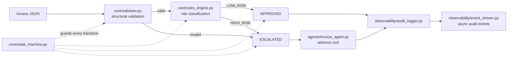
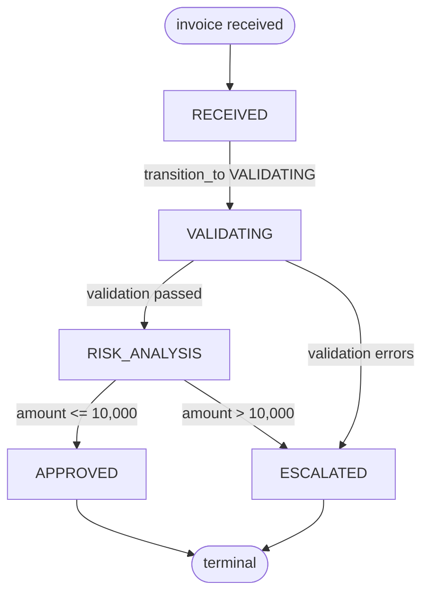

# Architecture Overview

A rule-based invoice workflow whose decisions are auditable. The design question this project answers is:
*how do you let an AI system act in a high-risk process without letting it decide?*

## Design boundary

| Responsibility | Owner | Reason |
|---|---|---|
| Structural validation, risk classification, state transitions | deterministic Python (`core/`) | the same invoice must always produce the same decision |
| Wording of a recommendation for a human reviewer | advisory agent (`agents/`) | text only — it cannot change state, approve, or release anything |

The agent receives an already-made decision and returns a sentence for the human. It holds no authority.

## Component view

## Lifecycle

Transitions are checked against an explicit allow-list in `core/state_machine.py`.
A state the workflow has no path to cannot be reached, and a refused transition leaves the state untouched.

Any other transition raises `InvalidTransition`. Approval before risk analysis, skipping validation, or
leaving a terminal state are all refused — each of these is covered by a test.

## Decision rules

| Rule | Implementation | Threshold |
|---|---|---|
| Required fields | `core/validator.py` | `invoice_id`, `vendor`, `currency` present; `amount` a positive number |
| Risk classification | `core/rules_engine.py` | `amount > 10000` → `HIGH_RISK` |

Both rules are plain code with no model in the loop, which is what makes the decision reproducible.

## Observability

- `observability/audit_logger.py` emits one line per committed decision: timestamp, invoice id, transition, decision, reason.
- `observability/event_stream.py` pushes the same events through an in-process queue consumed by a background thread, so an external sink (Elastic, Datadog, an audit store) can be attached without changing the core.

## Failure and edge behaviour

| Situation | Behaviour |
|---|---|
| Missing or malformed fields | rejected with an explicit error list; never reaches risk analysis |
| Negative or non-numeric amount | `INVALID_AMOUNT` recorded, escalated, advisory text emitted |
| High-risk invoice | escalated for manual review; no automatic approval path exists |
| Illegal transition attempt | `InvalidTransition` raised, state unchanged |
| Empty invoice id | workflow still runs; the audit line carries an empty id (see limitations) |

## Testing

`python3 -m pytest tests/ -v` — 11 tests, no third-party dependencies:

- `tests/test_validator.py` — invalid invoice is detected.
- `tests/test_workflow.py` — state machine accepts a legal transition.
- `tests/test_state_machine.py` — the three permitted paths, four refused transitions, and state integrity after a refusal.

The same suite runs in CI across Python 3.10–3.13, followed by a smoke test that executes the three
simulation scenarios.

## Known limitations

- `agents/invoice_agent.py` is a rule-based advisor with an explicit seam where a model could be added. It is deliberately not an LLM today, and the README does not claim otherwise.
- The audit sink is stdout. Nothing is persisted; a durable audit store is the next step for a real deployment.
- Invoice data is passed as a plain dict. There is no schema version field, so historical invoices cannot be re-validated against the rules that applied at the time.
- No performance claim is made: the repository demonstrates control flow and auditability, not throughput.
